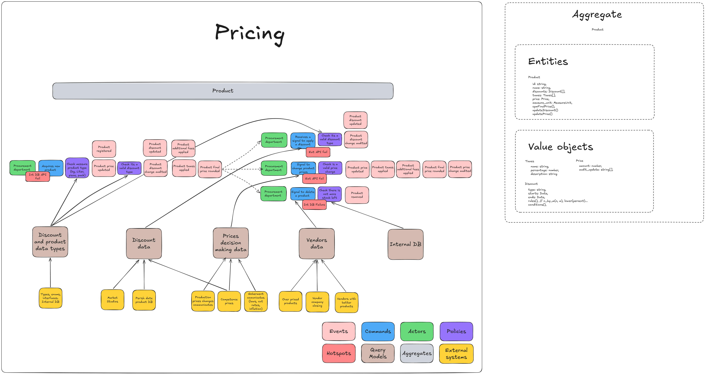

# Kata 01 Supermarket
Problem domain of pricing goods at supermarket. Analysis and design.

## Description
This repository provides a posible solution to [Kata 01](http://codekata.com/kata/kata01-supermarket-pricing/). The goal is to practice a looser style of experimental modelling, looking different ways of handling the issues as possible. Considering the various tradeoffs of each.

## Solution

## For more
More details and explanaition check my personal [blog post](https://justclayandcode.blogspot.com/2026/02/applying-ddd-on-pricing-goods-at.html
).

I'm open to suggestions please comment your insights :)